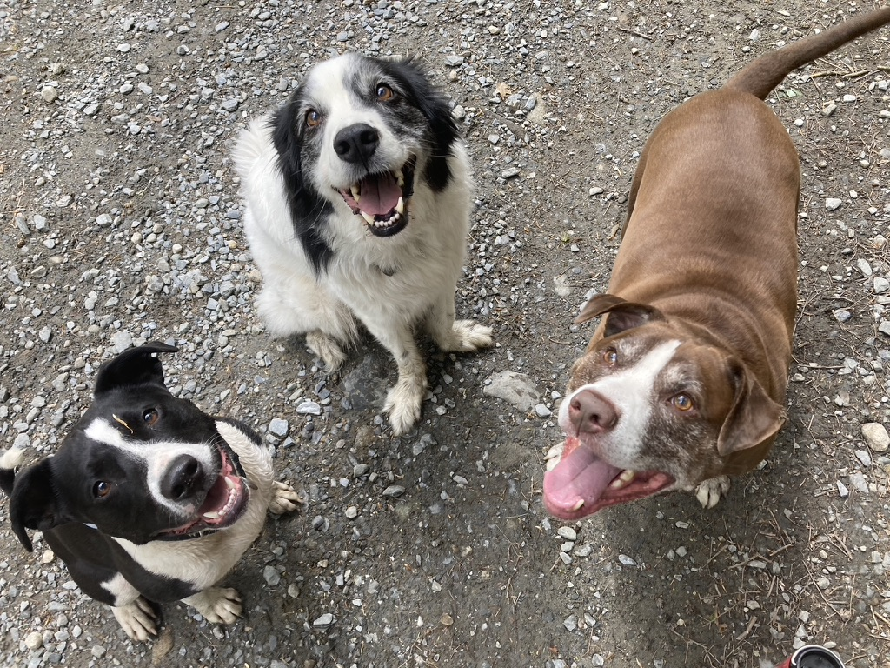
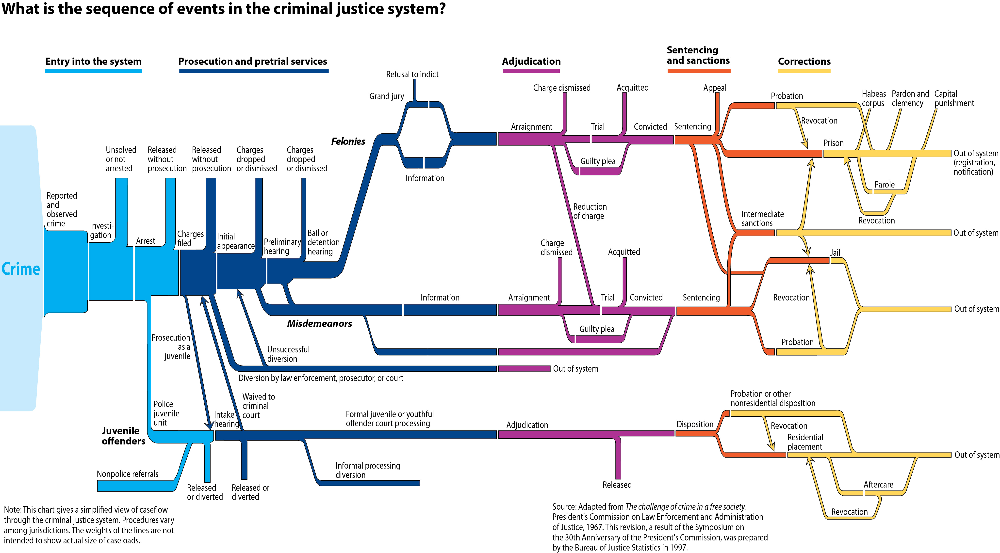
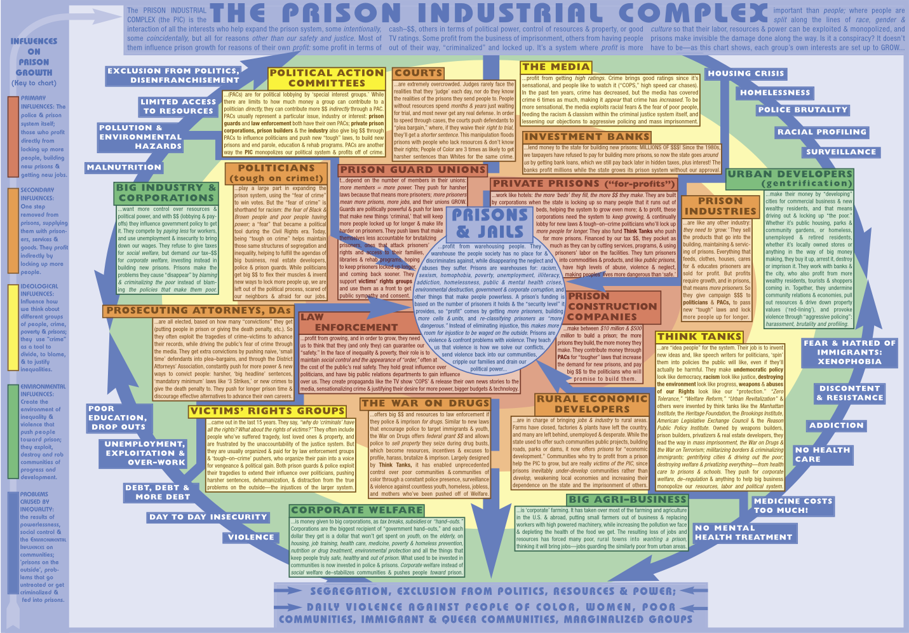

## Today's Agenda

-   Intros
-   Syllabus, Class Policies, etc
-   Sequence of events
-   PIC

------------------------------------------------------------------------

**Intros**

Chicken, Martin, Norman

## Your Turn

-   Name, pronouns (if you want), class year

-   Where do you consider yourself from?

-   If time travel or teleportation were possible, where/when would you go?

## BJS flow

{fig-align="center"}

------------------------------------------------------------------------

### What is the Prison Industrial Complex

## On sticky notes

Write ONE question or idea per sticky note and put it roughly in the section where you think it fits.

## Checkout:

*On a sheet of paper, write your name and then:*

Write **FIVE** questions you have about how the US criminal legal system works, why it works in a particular way, or what you're interested in studying.

##