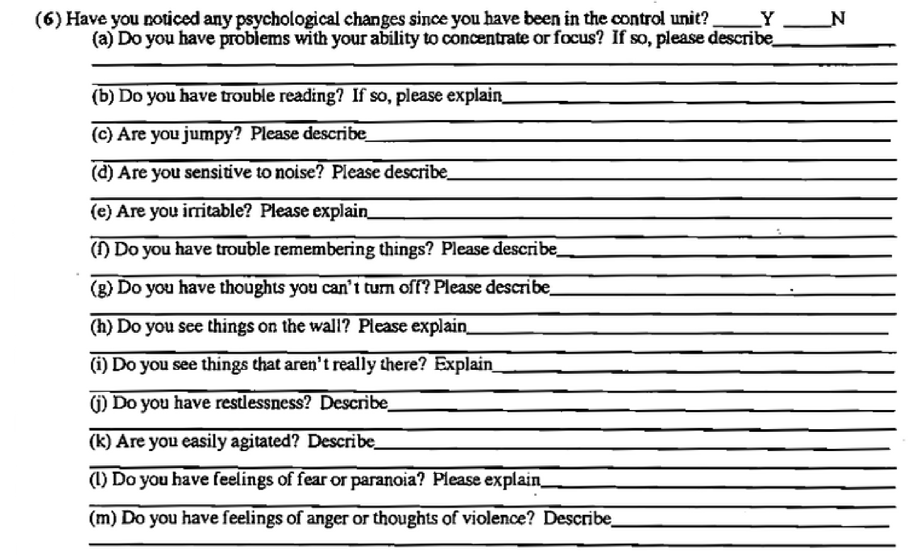

## Today's Agenda

In this session, we will cover:

-   Crime data!
-   Johnson - 2 regimes
-   Discussion Leader Time (Nikko)

<!-- Discussion Leader: Add your slides here -->

## Crime

## What is a crime?

::: incremental
-   Anything that is against the law.
-   Crime is a social construct
-   A social construct: anything that we collectively agree on
-   What used to be a crime but isn't now? / What is now a crime that wasn't before?
:::

1954 - Brown v Board

1967 - Loving v Virginia

1973 - Roe v Wade

## When someone is arrested for a crime

-   [Some jurisdictions collect DNA upon arrest](https://nij.ojp.gov/topics/articles/collecting-dna-arrestees-implementation-lessons)

-   Data is entered into criminal justice information systems ([federal record](https://www.ecfr.gov/current/title-28/chapter-I/part-20))

-   You can see operations manuals for some systems

-   [Illinois](https://isp.illinois.gov/LawEnforcement/GetFile/316d84e4-3e12-480b-adf8-5cb162632f94)

-   [New York](https://www.criminaljustice.ny.gov/crimnet/ojsa/crimereporting/ibr_refman/NYSIBR-Data-Capture-Elements-and-Specifications.pdf)

-   [UCR Book](https://ucrbook.com/)

# Discussion

<!-- Don't forget to PREVIEW the slide show in positron to make sure your changes look how you want them to! -->

## Links

[*The Angolite*'s study of longest-serving inmates](https://daily.jstor.org/the-lives-beyond-the-life-sentences/)

[Some prisons are using biometrics to track & monitor incarcerated people](https://www.aclu.org/news/privacy-technology/biometric-bracelets-for-prisoners)

Data collected *by* incarcerated people (eg *The Angolite*) consistently tells a different story than data collected by those on the outside. ([more about *The Angolite*](https://hnoc.org/publishing/first-draft/inside-angolas-prison-newspaper-the-angolite))

## 



## 

-   “State prison data is primarily concerned with counting and painting a picture of who occupies a system; what they did, what they look like, and what are some select individual behaviors. It rests on an assumption that everything is best known from afar —especially by those who receive training from Western universities, whose job it is to produce ‘valid’ knowledge (Mignolo, 2011), whereas community data collection grapples with the experience of living within the prison, the conditions that are faced, institutional failures, and the ripple effect of prisons on the wider community” ([Johnson, 2021, p. 2](zotero://select/library/items/BJE4HR4I)) ([pdf](zotero://open-pdf/library/items/JEKJLAG7?page=2&annotation=K7694WUX))

## 

-   “What might our research, policies, and understanding of the world look like if we move from a belief that the trajectory of a person’s life after prison is not determined by the years of formal education they have received, but whether they lived for years in a system that did not give them access to direct sunlight?” ([Johnson, 2021, p. 11](zotero://select/library/items/BJE4HR4I)) ([pdf](zotero://open-pdf/library/items/JEKJLAG7?page=11&annotation=M2D6YR7J))

## Questions?

-   Why do you think some questions are consisent across censuses? what impact do you think the [proposed changes](https://www.theguardian.com/us-news/2026/sep/09/trump-census-changes-immigrants) might have?
-   How does Johnson frame the differences between the Angolite/National Campaign to Stop Control Unit Prisons surveys and the state-run surveys?
-   How do you understand the National Acadamies meetings & reports now that you've read the Johnson piece? aka - how do we think about crime statistics?

## Exercise

Skim [this 19th article](https://19thnews.org/2026/09/hhs-study-trump-transgender-political-violence/?utm_campaign=feed&utm_medium=referral&utm_source=later-linkinbio) about a new HHS study.

## Checkout

On a sheet of paper, write your name and then...

Write 1 research question (draft!!)

How has your thinking changed since this conversation? (how do you want your data to have been collected?)

<!-- Discussion Leader: End your slides -->

## 

<!-- https://www.youtube.com/watch?v=0MYkS_npiss \<- this A & E policing by the numbers "just the facts" omg -->

```{=html}
<!-- cash bail
Many people are arrested and then detained for an undetermined amount of time, *before* they have been convicted of a crime.

[PPI - Pretrial Detention](https://www.prisonpolicy.org/research/pretrial_detention/)

[How cash bail works](https://www.brennancenter.org/our-work/research-reports/how-cash-bail-works)
-->
```