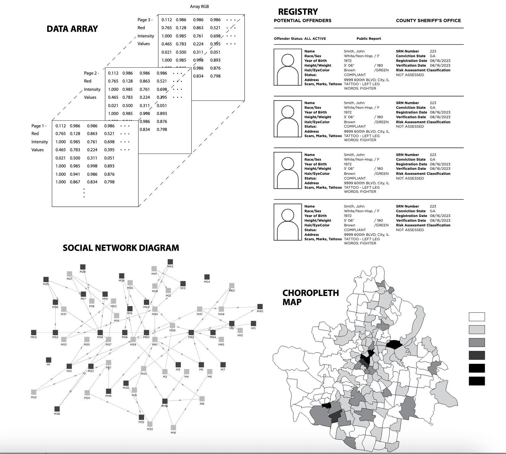

## Today's Agenda

In this session, we will cover:

-   Syllabus, Class Policies, etc
-   From crime to punishment: how the criminal legal system functions
-   Discussion Leader Time (Nikko)

------------------------------------------------------------------------

<!-- Discussion Leader: Add your slides here -->

<!-- End Discussion Leader Slide Space -->

## Checkout

On a sheet of paper, write your name and then:

