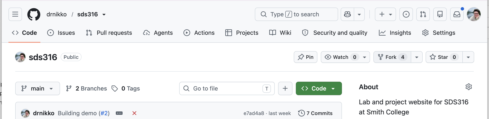
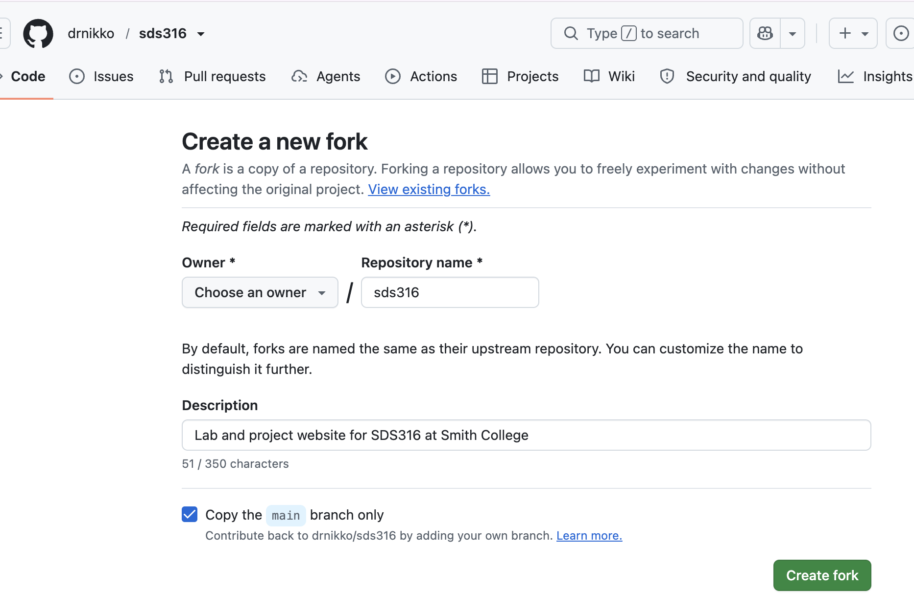
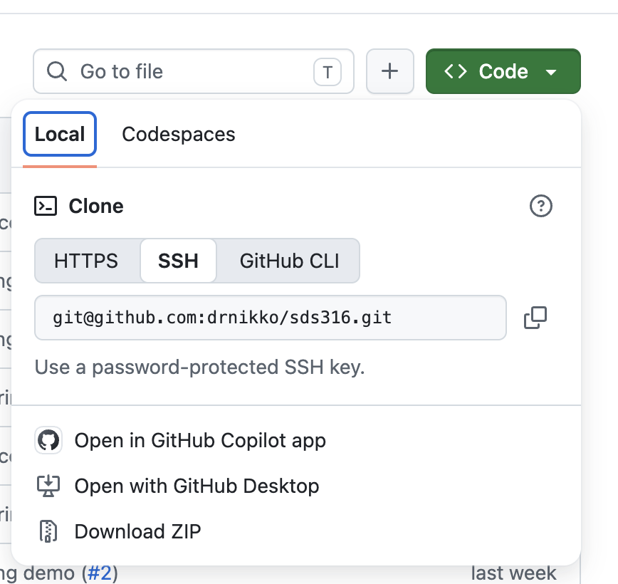
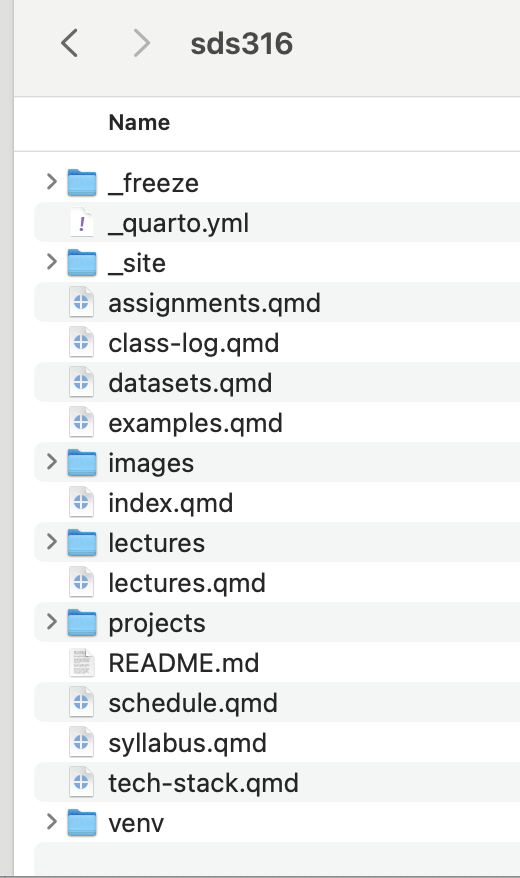
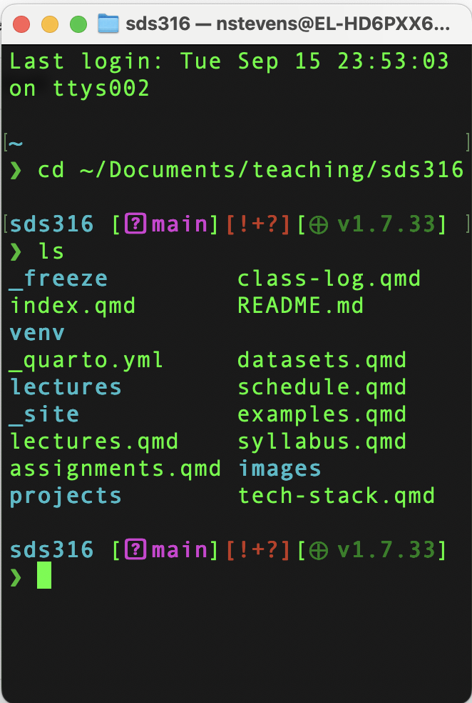
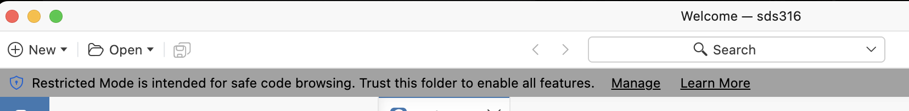
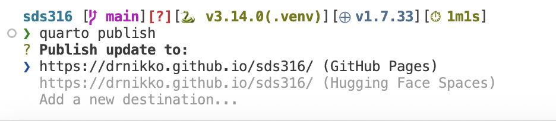

## Today's Agenda

End goal:

A fork of the class repo on your laptop *and* open in Positron *and* previewing.

------------------------------------------------------------------------

## Go here

### https://github.com/drnikko/sds316

## Click Fork



## Create a new fork



## Get the repo locally!

On your fork's repo page:



## Clone it

open terminal

``` bash
cd /wherever/you/store/work
git clone git@github.com:drnikko/sds316.git
```

```         
```

##### ssh problems?!

## Look at it!

Remember that the terminal and the Finder/Explorer are just different ways of accessing the same folders.

|                                      |                                      |
|------------------------------------|------------------------------------|
| {width="217"} | {width="260"} |

## Let's confirm

\<DEMO: make changes via one method and confirm via another\>

## Open Positron

1.  File \> Open Folder
2.  \<wherever you put the repository\>
3.  Open! (Manage, if necessary \> Trust)



## Configure Python virtual environment

open terminal in Positron (this is the same terminal - just easier to get at & it starts in your directory)

``` bash
python3 -m venv venv
source venv/bin/activate
```

## Install packages

in the SAME terminal

``` bash
python3 -m pip install jupyter pandas pyprojroot matplotlib
```

#### success?



## With the time that's left
- create a branch
- make a change
- commit change
- push to origin
- open a pull request

## Checkout

On a sheet of paper, write your name and then...

as best as you can remember, write the steps to get a repository from github onto your local machine and open in Positron?