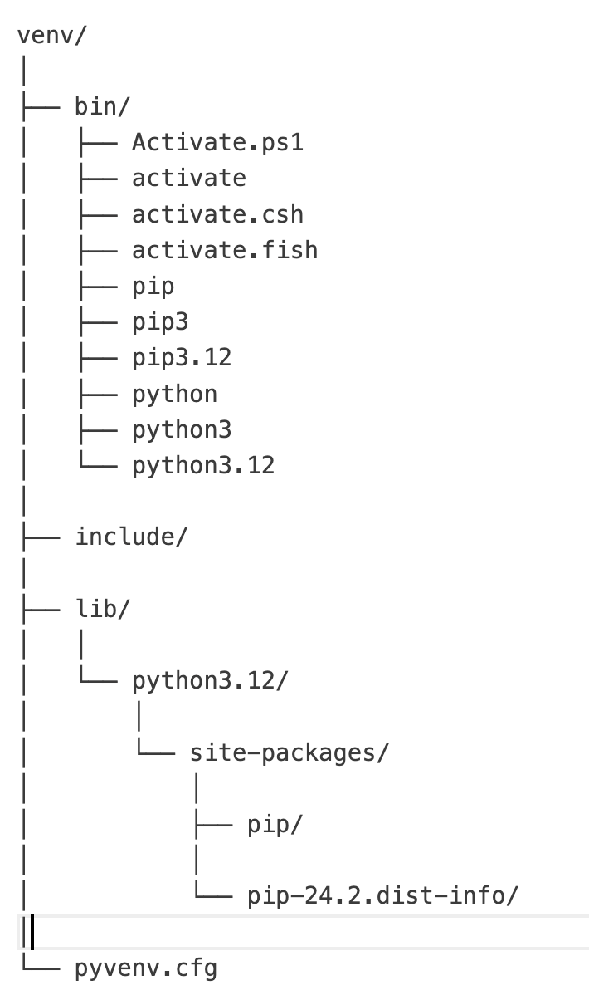
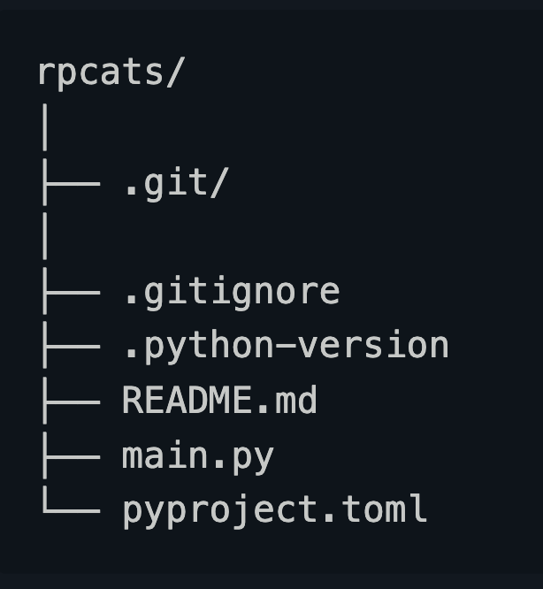

## First, some vocab:

-   **Python dependency:** an external package that a script (or other package requires to run)
-   **Executable:** a script that can be read and run by your computer without additional compiling
-   **Interpreter:** an executable file that takes a .py script and actually runs it <!-- ^[https://pydevtools.com/handbook/explanation/what-is-a-python-interpreter/] -->
-   **symlinks:** pointers that lead to a file
-   **PATH executable:** the directory in which a computer can search for executables when the full path name isn't given

<!--^[https://pydevtools.com/handbook/explanation/what-is-a-python-interpreter/] -->

## Why not just install packages globally?

-   Dependency conflicts! Different projects need different versions of packages (and each package may need a specific version of its dependencies)

```{=html}
<!-- ## What about just adding packages to your local directory? 
That should be enough isolation, right? 

No. You may have mulitple versions of Python/a Python interpreter downloaded; installing into your local directory doesn't allow you to specify what interpreter to use.  -->
```

## Enter Virtual Environments...

Essentially, a subfolder specific to a single Python version containing all of the executables and packages needed for your project.

Two types we'll cover today:

1.  Python's built-in environment manager: venv

2.  uv, modern package installer built in Rust

## Pros of Venv

1.  Built-in (no additional install)

2.  Easy to use and conceptualize

Venv is used largely for dependency isolation.

## What happens when you use venv?

Activating a venv changes where your computer assumes your files are! Here's what changes:

1.  sys.prefix and sys.exec_prefix:

-   sys.prefix: path to platform-*independent* (OS-independent) Python packages
-   sys.exec_prefix: path to platform-*dependent* (OS-ndependent) Python packages

## What happens when you use venv (cont.)

2.  PYTHONPATH:

-   tells Python where to look for modules (i.e., to go to venv sites-packaes NOT the base sites-packages)

3.  PATH variable changes

-   modifies the PATH variable to include the virtual environment Python executable

In short: Python is told to STOP looking for exectuables, modules, and 3rd-party packages in the directory where base Python is installed. Instead, Python looks for files inside the virtual environment

## What does a "venv" include?



-   **/bin:** stores the python interpreter, pip, and activation symlinks

-   **lib/sites-packages:** directory where 3rd party packages are installed

-   **/include** directory where C headers for packages are stored

-   **Configuration file:** all details needed to configure the venv

## What about uv?

-   faster package installation than venv/pip install
-   more robust dependency handling
-   project initialization (will initialize a root directory, git repo, .gitignore, etc.)

## What does uv include?



Here the .toml file is a configuration file!

## In conclusion...

-   always use some kind of virtual environment / project isolation method
-   use venv for "simple and dirty"
-   use uv for more complex projects that involve publishing or development

## Sources

1.  https://ashutosh-batra.medium.com/understanding-python-virtual-environments-venv-vs-uv-9d9811f2c073
2.  https://snarky.ca/how-virtual-environments-work/
3.  https://janelbrandon.medium.com/understanding-the-path-variable-6eae0936e976
4.  https://medium.com/@dakota.lillie/an-introduction-to-virtual-environments-in-python-ce16cda92853
5.  https://www.w3schools.com/python/ref_module_sys.asp
6.  https://realpython.com/python-uv/#installing-uv-to-manage-python-projects
7.  https://realpython.com/python-virtual-environments-a-primer/#a-folder-structure

<!--https://quarto.org/docs/presentations/revealjs/ -->